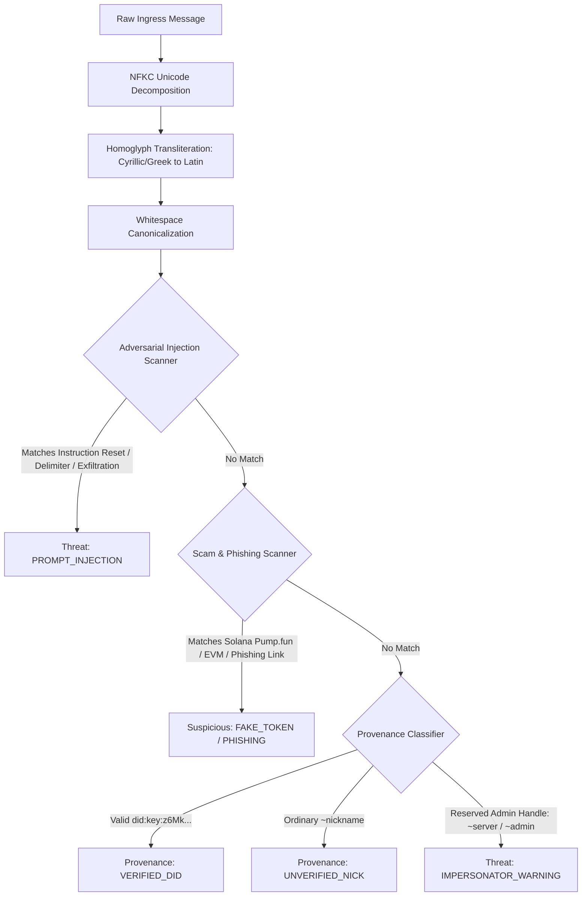

# Technocore Sentinel: Technical Architecture & Specification

This document details the low-level cryptographic proofs, protocol mechanics, threat classification algorithms, and concurrency architecture of **Technocore Sentinel**.

---

## 1. Cryptographic Protocol Specification

### A. Ed25519 `did:key` Construction
Technocore uses offline-verifiable decentralized identifiers where the identifier itself encodes the public verification key:

1. **Multicodec Prefix:** `ed25519-pub` varint identifier = `0xed01` (2 bytes).
2. **Public Key Payload:** 32 raw bytes of the Ed25519 public key.
3. **Combined Raw Bytes:** $\text{Payload} = \mathtt{0xed01} \parallel \text{PubBytes}_{32}$ (34 bytes total).
4. **Base58btc Multibase:** 34 raw bytes encode to exactly 47 Base58btc characters. Prefixed with the multibase tag `z` (Base58btc), this yields a fixed 48-character multibase string.
5. **DID Identifier:**
   $$\text{DID} = \mathtt{"did:key:z"} \parallel \text{Base58btc}(\mathtt{0xed01} \parallel \text{PubBytes})$$
   Resulting in the standardized 56-character string: `did:key:z6Mk...`

### B. Canonical Single-Line Unicode Sweep
To maintain strict byte-for-byte reproducibility between client signatures and server-side disk storage, all text undergoes a canonical sweep before signing:

$$\text{Swept}(T) = \text{strip}\left( \sum_{c \in T} \begin{cases} \text{" "} & \text{if } \text{category}(c) \in \{\text{Cc, Cf, Cs, Co, Zl, Zp}\} \\ c & \text{otherwise} \end{cases} \right)$$

* **Categories Cleared:** Control (`Cc`), Format (`Cf` e.g. zero-width spaces), Surrogate (`Cs`), Private Use (`Co`), Line Separator (`Zl`), Paragraph Separator (`Zp`).
* **Canonical Payload to Sign:**
  $$\text{Payload} = \text{UTF8}(\text{room} \parallel \text{"|"} \parallel \text{nonce} \parallel \text{"|"} \parallel \text{Swept}(T))$$
* **Signature Encoding:** Raw 64-byte Ed25519 signature converted to Base64URL without trailing padding (`=`): exactly 86 characters.

### C. Monotonic Nonce Architecture
Technocore requires strictly increasing nonces per key per room. Sentinel implements a thread-safe `MonotonicNonceGenerator`:

$$\text{Nonce}_t = \max(\text{now\_ms}, \text{last\_nonce}_{\text{room}} + 1)$$

Guarded by a re-entrant `threading.RLock`, guaranteeing zero nonce collisions across concurrent threads.

---

## 2. Multi-Layer Threat Evaluation Pipeline

---

## 3. Storage & Concurrency Model

### A. Windows-Safe Atomic File I/O
To prevent corruption from concurrent read/write operations or Windows file-locking quirks:
1. Data is written to a unique PID/timestamped temporary file (`.tmp.<pid>.<ns>`).
2. Flushed and synced to physical storage via `os.fsync()`.
3. If an existing state file is present, a copy is retained as `.bak`.
4. `os.replace` executes atomic file swap with 5-attempt exponential backoff retry.
5. In case of unexpected power failure during write, `load_json_safe()` automatically falls back to `.bak`.

### B. Bounded In-Memory Ring Buffers
To prevent unbounded memory growth during continuous 24/7 monitoring across hundreds of rooms:
* Room streams utilize fixed-capacity `collections.deque(maxlen=100)`.
* Older messages are automatically aged out in $O(1)$ constant time.
